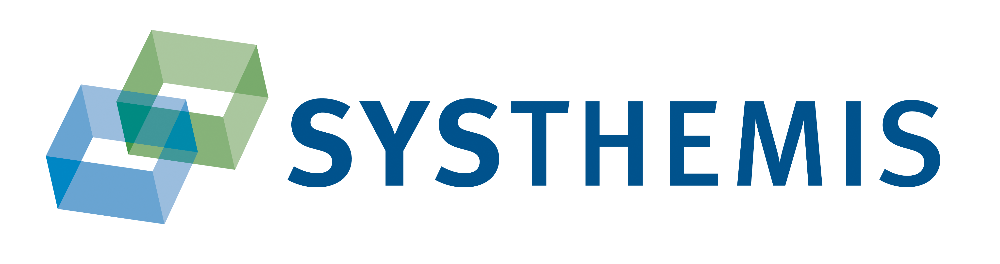

## Problem

During the COVID-19 pandemic, cancer patients were harshly affected by the lockdown.
Unable to visit doctors on demand and without the option to attend physical checkups,
a modern solution for communication with their preferred practitioner was needed.

## Idea

A conducted study showed that despite the high average age of head and neck cancer 
patients, they are open to a digital solution.

So, we developed an app for the German market with a strong focus on accessibility.
For ease of use, we decided to develop a progressive web app. 
This allows for use on both home computers and mobile devices, 
ensuring a seamless experience for all users, including those with disabilities.

The app includes a symptom diary, an information center, and allows a patient to share 
their entered data with their practitioner. This can help both the patient and the
practitioner schedule appointments on demand.

## Getting Started

To allow further development on this project, please follow the steps in the sections
["Requirements"](#Requirements) and ["Installation."](#Installation)

### Requirements

Please make sure that you have already installed the following Programs.

- Node Version Manager

Alternative:
- Node v20.11.0 
- Npm 10.2.4

### Installation

1) Clone the repository:

       `git clone https://github.com/healthcare-hackathon-wuerzburg/systhemis.git`

2) Using the correct npm and Node Version:

   If you are using Node Version Manager, as described in Section ["Requirements"](#Requirements), 
 please run the following command first. This will install the correct Node and
 Npm version. Note that the script will ask you for administrative access to 
 finish the installation.

       `.\.setup\a-EnvVariable.bat`

    If you are using a manual installation of Node and npm, please make sure you are using the versions described in the ["Requirements Section."](#Requirements)

3) Navigate into the project directory (Assuming you cloned it into the default folder):

       `cd systhemis/frontend`

4) Install dependencies:

       `npm install`

5) Start the development server:

       `npm run dev`
6) Open your web browser and visit http://localhost:4200.

## How to use the Project 

The basic functionality of the program is secured behind a user login. 
The application comes with pre-registered users for each group. 
To quickly get an overview of the application's functionality, 
please log in using one of the following users:

| Username         | Password   | Role      |
|------------------|------------|-----------|
| username@test.de | hallo123   | Patient   |
| dr_jones@ukw.de  | geheim     | Physician |

As a patient, you can:
- Access a variety of information in the form of PDFs.
- Write journals for your overall mood, feelings, and symptoms.
- Analyze your journal entries with a variety of graphical charts.

As a physician:
- TODO: Aufnehmen wenn Alex so weit
- Not available in the current version.

## Deployment

In order to deploy the application, you will need a web server to host it. 
We assume that you have access to both the web server's host directory and configuration.
At the end of this Section, we include an example configuration for an NGINX-Server.

1) Build the project using the following command:

       `ng build`
2) Copy everything within the output directory (dist/heal-connect/) to your 
web server's host directory. 
The name and location of the host directory are dependent on the specific web server.
Please refer to your web server's documentation for more information.
3) Configure your web server to redirect requests for missing files to index.html.
Since this application is a single-page application, your web server needs
to redirect any requests back to index.html. Once again, 
this configuration is dependent on your specific web server, 
so please consult its documentation.
4) Test your deployment by opening your web server's URL in any browser.
If you cannot access any pages beyond the landing page, 
your configuration may be incorrect.

As NGINX is the most common production server, we include an example configuration for it here.
This configuration assumes you have provided a certificate for HTTPS encryption; 
your locations and certificate names may vary. 
Please note that this example is specific to NGINX and may not work on all web servers.

```
server {
    listen 443 ssl;
    server_name localhost;
    ssl_certificate ca.crt;
    ssl_certificate_key ca.key;

    location / {
        root /usr/share/nginx/html;
        index index.html;
        try_files $uri $uri/ /index.html;
    }
}
```

## Project Overview

TODO:
Describe how the project is structured. 
Describe the architecture and the main components (if necessary) and the interaction between these components.

## How to Contribute

If you want to contribute to the further development of the application,
you may follow the steps below:

1) Set up the repository on your local machine, as described in the ["Installation Section".](#Installation)
2) Work on a dedicated branch for your feature:

       `git checkout -b feature_name`

3) Once your feature is complete, create a pull request for the feature and document the changes accordingly.
   - Please remember to update this readme if necessary.
4) Please make sure that your code has some unit tests to ease the review process.
5) Send changes against the `main` branch.

## Further Steps

As the application was developed in a hackathon, there are many features that can still be implemented. Some of these include:

- An Administration User Role
- A Physician's Assistant User Role
- Proof of a medical license for a doctor's registration
- Check and approval of a doctor's registrations by administrators
- Check and approval of a physician's assistant registration by a doctor
- Communication between patient and physician via chat
- Communication between patient and physician via call
- Permanent Data Storage
- Centralized Backend

## Useful links:

- [Most common Git commands](https://rogerdudler.github.io/git-guide/index.de.html)
- [How to create a GitHub Release](https://docs.github.com/en/repositories/releasing-projects-on-github/managing-releases-in-a-repository)
- [Healthcare Hackathon Würzburg](https://www.healthcare-hackathon.info/hhwuerzburg)
- [Universitätsklinikum Würzburg](https://www.ukw.de)
- [SYSTHEMIS AG](https://systhemis.de)
- [HNO-Klinik](https://www.ukw.de/hno-klinik)

## Colaborators:
[](https://www.healthcare-hackathon.info/hhwuerzburg)
[](https://www.healthcare-hackathon.info/hhwuerzburg)
[](https://systhemis.de)
[](https://www.ukw.de/hno-klinik)
